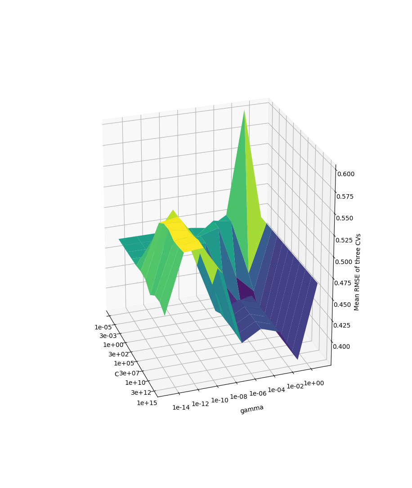
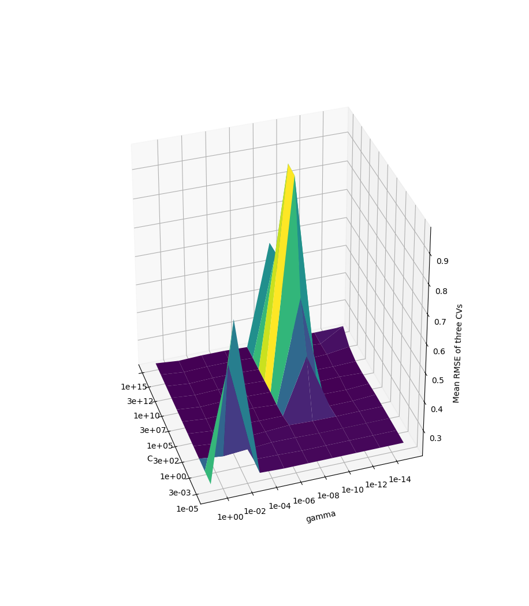
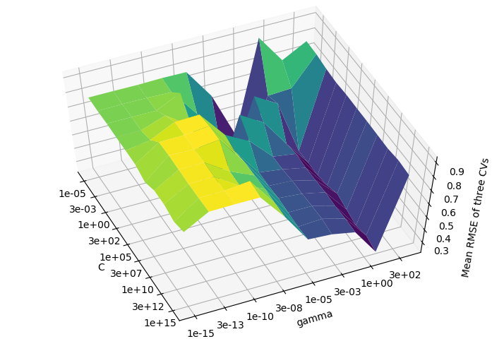

% Lazada Title Quality Challenge
% Rodrigo Valle, Krit Saefang, Bill Tang
% March 16, 2018

# Abstract

In this paper, we search for a reasonable approach to classify titles as either
clear or unclear and concise or not concise. This might be useful for websites
with user submitted content, who would want to flag titles which do a poor job
of communicating their intent in order to improve user experience. Being
significantly cheaper and less tedious than paying someone to manually label the
quality of a title, especially with a reasonable error rate, we believe our
solution is valuable. We explore, build, and evaluate three major machine
learning models for classifying titles: Naive Bayes, Support Vector Machines
(SVMs), and Neural Networks, as well as multiple ways to summarize titles into
feature vectors to be used in conjunction with our models.

# Background and Problem Definition

Title classification is done on a dataset with product titles and their
associated information including: description, categories and price, along with
a few less relevant tags. Each title in the training set has been labeled
individually by Lazada's quality control team as either clear or unclear and
concise or not concise. Our goal is to train a model that, given a product title
and its associated information, can predict the probability that the title
belongs to each of the "clear" and "concise" classes. Models will be evaluated
by using the Root Mean Squared Error (RMSE) of the models predictions when
compared to the ground-truth labels, defined as follows:

$$\text{RMSE} = \sqrt{\sum \dfrac{(y_{\text{pred}} - y_{\text{ref}})^2}{N}}$$

Since labels for the test and validation data on the competition website are not
provided, we will be splitting the test set of roughly thirty-six thousand
titles into test and training sets, with sizes of about 4/5 and 1/5 of the
original data respectively. This should still be more than enough data to train
our classifiers, some of which have long runtimes, although the additional data
might improve our results. This is something we discuss in the future work
section of the SVM model.

Title classification can be tricky for various reasons, the most concerning one
being that labels such as "clear" and "concise" are not well defined. The
dataset was labeled by several different people, so there may be even less
concistency between examples. In general, the dataset will have noise and
coupled with the fact that these concepts are not well defined and subject to
personal preference, a perfect classifier is simply impossible to achieve.
However, we can still do a reasonably good job of classifying titles regardless.

# Methods

## Naive Bayes

### Introduction 
Naïve Bayes are a family of probabilistic classifiers based on Bayes’ Theorem.
These classifiers are simple and are applicable to many uses, such as document
classification and spam filtering. Compared with other methods studied in this
report, they are fast to train and, in theory, does not require much data to
train on. Compared to neural networks, Naïve Bayes is a calculation, and thus
less demanding in processing power and resource requirements. 

For the project, three implementations of the Naïve Bayes was used. These are of
the scikit-learn package as is the SVM implementation used. The first is the
Gaussian Naïve Bayes, an implementation where the likelihood of the features is
assumed to be Gaussian. Second is the Multinomial Naïve Bayes, where the data us
assumed to be multinomial distributed. The multinomial implementation is one of
the classic variants used for text classifications. The third and final
implementation is the Bernoulli Naïve Bayes, suited for data with multivariate
Bernoulli distributions, and would work well with binary valued data. [1]

The given test data was split up at the 11000 from last item mark, roughly two
thirds of the given data.  Everything up to the last 11000 entries are used as
training data, given to the classifiers along with the label, and the remaining
11000 is used for validation testing, using the labels to check for errors. The
data will be vectorized before being fed into the classifiers. 

All three implementations were fed the same data, features, and, if applicable,
tested with same settings, such as priors and smoothing settings. Tests were
done with base settings (Title or description only, with no further tweaking),
without smoothing applied, using titles along with categories, using titles
along with categories but without smoothing, without using fit priors, and using
with class priors.  Class priors were given as [0.685,0.315] and [0.943,0.053]
for clarity and concise respectively.  In addition, another feature list for
testing conciseness, shared with the neural network tests, will be used as well. 

### Gaussian Naïve Bayes 
The Gaussian Naïve Bayes implementation was the first to be used. The
implementation allows feeding in the prior probabilities of the class. Compared
to the other Naïve Bayes implementations tests, Gaussian Naïve Bayes suffers
from higher resource usage and is much slower. This is a consequence of
requiring matrices be dense matrices. In order to get Gaussian Naïve Bayes to
actually run, the virtual machine used to do the tests had to be given about
10GB of memory to work with, and even with this, applying Gaussian Naïve Bayes
for the clarity tests failed due to not enough allocated memory. Because data
batching was not done, results for Gaussian Naïve Bayes were skipped for the
clarity tests. [2] 

The results of conciseness test were poor compared to the other implementations.
The RMSE for the base fit was 0.690, and remained approximately the same across
the tests using both titles and categories, and with class priors. Using the
features shared with the neural network tests, the results improved to 0.577.

+-----------------------+---------------------+
|                       | RMSE for GaussianNB |
+-----------------------+---------------------+
| Base                  | 0.690               |
+-----------------------+---------------------+
| Title with categories | 0.690               |
+-----------------------+---------------------+
| With class priors     | 0.690               |
+-----------------------+---------------------+
| Generated features    | 0.577               |
+-----------------------+---------------------+

### Multinomial Naïve Bayes 
The implementation for Multinomial Naïve Bayes performed much better than the
Gaussian implementation. To start, it did not require matrices being fed in to
be dense, and as such sparse matrices works. Unlike the Gaussian implementation,
Multinomial Naïve Bayes actually has a smoothing function, and allows the
toggling of fit priors. [3] 

Because of the sparse matrices, training and predicting are also much faster.
And even more, it was able to complete the clarity tests as well. For the
concise tests, base results without medications resulted in the best RMSE
results at 0.460. Multinomial Naïve Bayes performed very well with the clarity
tests, clocking 0.275 as its best RMSE result, on base settings. Turning off
smoothing and adding features does not seem to help in terms of improving
results, nor did disabling fit priors and providing class priors. The generated
features does not work with Multinomial Naïve Bayes due to having non-discrete
negative values and as such was skipped. 

+------------------------------------------+----------------------------------+----------------------------------+
|                                          | RMSE for MultinomialNB - Concise | RMSE for MultinomialNB - Clarity |
+------------------------------------------+----------------------------------+----------------------------------+
| Base                                     | 0.460                            | 0.275                            |
+------------------------------------------+----------------------------------+----------------------------------+
| Without smoothing                        | 0.491                            | 0.362                            |
+------------------------------------------+----------------------------------+----------------------------------+
| Titles with categories                   | 0.496                            | 0.311                            |
+------------------------------------------+----------------------------------+----------------------------------+
| Titles with categories without smoothing | 0.508                            | 0.447                            |
+------------------------------------------+----------------------------------+----------------------------------+
| Without fit priors                       | 0.478                            | 0.320                            |
+------------------------------------------+----------------------------------+----------------------------------+
| Without class priors                     | 0.501                            | 0.401                            |
+------------------------------------------+----------------------------------+----------------------------------+
| Generated features                       | No data                          |                                  |
+------------------------------------------+----------------------------------+----------------------------------+
 
### Bernoulli Naïve Bayes 
The last Naïve Bayes implementation tested was the Bernoulli Naïve Bayes. Like
Gaussian Naïve Bayes, Bernoulli Naïve Bays ran into issues with exceeding
available memory, although this time it was solved by using a hashing vectorizer
instead of the count vectorizer as used by both Gaussian and Multinomial
implementations. Training and prediction speed was faster than Gaussian, and not
too much different from Multinomial. Like the Multinomial implementation, it has
a smoothing function, and allows the toggling of fit priors in addition to being
able to use class priors. [4] 

Like the Multinomial Naïve Bayes implementation, Bernoulli Naïve Bays didn’t
result in any significant RMSE results for the clarity tests, but did do well
with the concise test. On average, the results for the clarity tests were higher
than those provided by Multinomial, with the best result coming from turning off
smoothing. For the clarity test, Bernoulli Naïve Tests achieved the best results
out of the three implementations scoring 0.237 at the lowest using only the
title and title with categories. 

+------------------------------------------+--------------------------------+--------------------------------+
|                                          | RMSE for BernoulliNB - Concise | RMSE for BernoulliNB - Clarity |
+------------------------------------------+--------------------------------+--------------------------------+
| Base                                     | 0.560                          | 0.237                          |
+------------------------------------------+--------------------------------+--------------------------------+
| Without smoothing                        | 0.479                          | 0.384                          |
+------------------------------------------+--------------------------------+--------------------------------+
| Titles with categories                   | 0.560                          | 0.237                          |
+------------------------------------------+--------------------------------+--------------------------------+
| Titles with categories without smoothing | 0.508                          | 0.401                          |
+------------------------------------------+--------------------------------+--------------------------------+
| Without fit priors                       | 0.560                          | 0.751                          |
+------------------------------------------+--------------------------------+--------------------------------+
| Without class priors                     | 0.560                          | 0.751                          |
+------------------------------------------+--------------------------------+--------------------------------+
| Generated features                       | 0.528                          |                                |
+------------------------------------------+--------------------------------+--------------------------------+

### Conclusions with Naïve Bayes 
While Naïve Bayes, with the setups as done in this report, did not give good
results for clarity test, they did decently well with the concise tests. These
numbers are, however, still unmatched by results from our tests with SMV and
TensorflowNN, both of which provided much better results in the sub 0.1s.
TensorflowNN in particular, reached an MSE result of 0.045. However, compared to
Tensorflow as will be shown, Naïve Bayes can give its results with significantly
less resources required and time spent.

An interesting observation is that under almost all circumstances, using the
base settings alone resulted in some of the best predictions available from
Naïve Bayes, and that adding priors or other features such as categories into
the training only serves to worsen the results. Parts of this could be argued
that the requirements for scoring these tests didn’t really look into the
accuracy of the titles and descriptions themselves, and other attributes such as
length may play bigger role in being a good determinant for predictions. 

The rather high results from the tests could also indicate that Naïve Bayes may
not be the most suitable method for the given task, lacking in concepts that
a neural network may be able to learn and adapt to.  All the tests done with
Naïve Bayes had training and prediction done within or around one minute, and
within the 10GB memory cap (with the exception of Gaussian Naïve Bayes which
exceeded 10GB for the concise tests). Compare this to Tensorflow’s 20 minute
training time and reaching 40GB in data requirements and the trade-offs are
clear. 

### Future work with Naïve Bayes There are still more feature combinations that
could be tested to see if results can be further improved.  What was tested in
this report is nowhere near exhaustive and other derivable features such as text
length and combinations of titles and descriptions can be looked into. Different
feature lists can be generated and used to as well to see the results of various
combinations.  While it can be argued that the method itself is not suitable for
the given tasks, it doesn’t mean it’s not possible to improve the results, as
even if the prediction is not as good as other methods, its speed and resource
requirements can still lend it an upper hand under conditions where speed is
required and resources lacking. 

## Support Vector Machine
The support vector machine classifier, at its core, separates labeled data in
$n$ dimensional space with an $n-1$ dimensional hyperplane. The best hyperplane
is chosen as one that separates the two classes with the widest possible margin,
measured as the closest member to the hyperplane from each class.

Most of the time though, data is not linearly seperable in $n$ dimensions and so
to get around this (and make support vector machines the stable and widely used
tool that they are today), support vector machines will map $n$ dimensional
vectors into some higher dimensional space where the data *can* be separated by
a hyperplane. [8]

### Model Selection
We did our training of the SVM model using SciKit Learn's implementation, which
in turn relies on the LibSVM library. There's a few different kernels that
SciKit Learn lets us use for this higher dimensional mapping trick, but it's
been the author's experience that of the four options: "linear", "polynomial",
"rbf", and "sigmoid", the "rbf" kernel usually performs the best. This kernel
choice was made in order to minimize the search space for good model
hyperparameters in the later hyperparameter grid-search.

The model, with the Radial Basis Function (RBF) kernel specified, has two major
tunable hyperparameters: C and gamma. The C parameter is a tradeoff between
"misclassification of training examples agains the simplicity of the decision
surface" [5]. A high C might classify more training examples correnctly at the
expense of a more complicated separation, and a low C will cause the model to
output a smoother separation surface at the expense of misclassifying more
training examples. The gamma parameter has to do with the radial basis function
kernel and the influence of each training example as related to distance.
A higher value of gamma means a smaller sphere of influence for each training
example, and could make the final model suceptible to overfitting. Likewise,
a lower value of gamma might combat overfitting, but we might lose some
structural patterns in the original data, contributing to worse predictions.

### Feature Generation from Titles
Arguably the most important part of a good support vector machine based model
is a good feature space, where the different lables can be linearly separated.
To get off the ground, we relied on SciKit Learn's CountVectorizer class, with
the binary option set to true, to turn each product's title into a vector. Each
dimension in this feature space represents a unique word. For a given title,
a dimension is set to 1 if the corresponding unique word exists in the title,
and 0 otherwise.

We chose this mapping of titles to features because alternative popular mappings
such as term frequency-inverse document frequency or TD-IDF generate noisy
feature vectors when used with a corpus of short strings such as titles, and its
behavior is not suitable for our needs. TD-IDF works well on larger documents
because it values words that appear frequently within a particular document
(or small subset of documents), but penalizes words that appear frequently in
most documents. This is not what we want because an overabundance of these
globally frequently occurring words in any one particular title might signify
a title of poor quality, and in addition, produces noisy feature vectors with
short documents. The binary features that we chose to start with are simple,
lightweight, and resistant to noise, even if they are high dimensional. [10]

Later in our investigation, it became apparent that better feature vectors were
necessary if the model was going to improve. These binary word vectors did not
capture enough of a title's semantic properties to allow the SVM to find a good
separation.

To get around this, we employed the use of the Word2Vec based Doc2Vec algorithm
to encode titles as vectors [9]. The Doc2Vec neural network trains on all titles in
the training set in order to build a feature space where related documents are
close to each other. For our purposes, we tagged each document with the three
categories of product that it belonged to, in order to give Doc2Vec a better
chance at guessing the semantic meaning behind a particular title. Then we can
use the model to infer the feature vector of titles that we haven't trained on,
and we can add a few other title measurements such as the length of the title in
ASCII characters and also words, the number of nonalphanumeric characters
present in the title, etc.

### Experiments Design and Evaluation

#### Grid Search for Hyperparameters
In order to choose reasonable values for the hyperparameters C and gamma, we
performed a grid search across the ranges
C = $[10^{-5}, 10^{-3}, ..., 10^{-13}, 10^{-15}]$ and
gamma = $[10^{-15}, 10^{-13}, ..., 10^1]$ [7].

Gridsearch works by training an SVM on each pair of these parameters and
performing cross validation to see which parameters yield an SVM with the lowest
error. Gridsearch is expensive, so we had to be smart about our cross validation
strategy.

Initally, we take the dataset and perform a stratified k-folds separation, where
we split the dataset into 5 different sections and keep 4 for training and 1 for
testing the completed model. We want the split to be "stratified" so that it
keeps the same distribution of labels. Our original dataset for clarity and
concise labels is very skewed, with these labels being true with a high
probability, so this is important for a fair evaluation of future performance.

Then, of the initial training set, we create our features as described above
and perform a Stratified Shuffle Split, randomly selecting 1/5 of the input
data to train the parametrized SVM and another 1/5 to evaluate it, while
maintaining label distribution. This produces results quickly because we're not
training on as much data. Combined with GridSearchCV's concurrency feature and
we get cross validation results that look like the following figures in
a reasonable amount of time (a few hours):

The results for the clarity gridsearch were not so clear, so we ran it again but
this time using the imblearn pacakge's SMOTE implementation with default
settings. Adding SMOTE to our cross validation pipeline will redistribute the
label frequencies by oversampling the minority class and undersampling the
majority class. This allows us to see how well our model might perform on a more
balanced dataset, which is useful for our gridsearch where we want to choose
good hyperparameters. In general, this skew of our dataset can be used to our
advantage, so we wouldn't want to train using SMOTE because it might cause the
SVM to think that certain labels are more frequent than they actually are [6].

##### Final Results
With the gridsearch results, we can see that the best value for gamma is
approximately $10^-1$ and C is approximately $10^5$, for both models. Using
these values, we trained an SVM for each "concise" and "clarity" class using our
binary word features and our Doc2Vec features. Our results are as follows:

+---------------------------------------+---------------------+--------------------+
| Features                              |    RMSE - Concise   |   RMSE - Clarity   |
+=======================================+=====================+====================+
| Binary Word Vectors (no gridsearch)   |    0.4346           |   0.371            |
+---------------------------------------+---------------------+--------------------+
| Doc2Vec Title Vectors (gridsearch)    |    0.4543           |   0.230            |
+---------------------------------------+---------------------+--------------------+

The SVM trained on Binary Word vectors was trained on 26282 training examples
and the parameters C = $10^3$, gamma = $1/26282$.

The SVM trained on Doc2Vec title vectors with clarity labels was trained on only
1/5 of the labeled dataset, and tested on a separate 1/5 of the labeled dataset
because training times were too extravagant. The performance of the SVM with
doc2vec features seemingly decreased on the "concise" label; this could be due
to a poor choice of hyperparameters. GridSearchCV could not be performed with
doc2vec features because the computational power necessary was simply
unavailable; perhaps a revision of the GridSearchCV process could speed things
up further, or one of the alternate SVM models we describe below.

##### Future Work
In the future, with such a large dataset, we ran into a lot of issues regarding
SVM runtime. There are a couple ways to fix this; we could try using a LinearSVM
whose training time is significantly shorter than the standard RBF SVM. There
are several "linearl learner" SVM implementations too, better suited for large
datasets. We could also try training an ensemble of SVMs so as to be able to
parallelize SVM training process.

The dataset also provides a lot of unlabeled validation and test data files,
which our current models can't make use of. To get around this, we might try
training a transductive SVM, or TSVM, which is a semilearning SVM model that can
use unlabeled data to try and lower our RMSE scores. It would probably work to
improve our testing, but runtime is too significant for even our standard SVM so
this might prove to be too unwieldy to be useable.

A further improvement might be to use the label output from the clarity model in
the conciseness model or vice versa, because looking at the data it's pretty
clear that these two labels are somewhat dependent on each other.

## Deep Neural Networks

Deep neural networks are powerful universal classifiers that have the ability to
easily learn non-linear correlations between inputs and outputs. Relying on
iterative training steps aimed at minimizing prediction loss, neural networks
are able to gradually learn connections between features and labels, making them
very effective models for classification. The main advantage of deep neural
networks over other iterative approaches lie in the hidden layers that allow for
the learning of arbitrary functions. 

### Feature extraction and selection
One of the major challenges faced
in constructing the model came from feature selection. Our task was to classify
title clarity and conciseness for products, and it was not immediately obvious
which features should be selected, and how they should be transformed into
numerical values that could be fed into a neural network. 

First, our input data was preprocessed, using BeautifulSoup to remove unwanted
html tags and cleaned so that words were all lowercase. The preprocessed
features are combined with the clarity and conciseness labels are exported into
a csv so they can be easily loaded and reutilized. 

Initially, experimentation was conducted using simple easily extracted or
calculated statistical features such as title length, number of title words,
number of non alphanumeric characters, and other potentially related variables.
Training on these initial features gave us RMSE values of around 0.48 for
conciseness and 0.25 for clarity. 

The vectorization of the groups of words formed the core of the feature set for
the deep neural network model. After experimenting with bag of word models using
tensorflow built in vocab processor with only marginal improvements in RMSE
scores, we chose to use the Stanford’s GloVe word embedding model in order to
generate word embeddings that retained information about linguistic and semantic
similarity [14]. To transform titles, categories, and description strings into
vectorized features, the mean GloVe embedding vector was calculated by taking
the mean of all the 200 dimensional word vectors generated from the string
words. This embedding allowed us to further generate interesting features like
the relatedness between the title and description and categories by calculating
the norm between the corresponding mean embedding vectors. 

Finally, we also utilized linguistic features from the Spacy natural language
processing libraries ‘en’ language model to generate more numeric features from
our title, category, and description strings [15]. We extracted noun chunks from
title strings, category strings, and description strings, and once again
calculated mean embedding vector norms between them. We also incorporated counts
of part of speech classification for words in the title strings. Put together,
there are a total of 232 features that are fed into the input layer of the
model.

### Model Description
In this project, we built a feed-forward deep
neural network on top of the Tensorflow framework using Keras. The model
consists of the input layer, two dense hidden layers with hidden units of 100
and 50 units using ReLU activation functions, an output softmax layer with the
two possible classes, and an additional dropout layer with a dropout rate of
0.2. 

The ReLU or rectified linear unit is an activation function that has become very
popular in recent years. It computes the function f(x) = max(0,x). It has been
found to greatly improve the convergence speed of gradient descent optimizers
when compared to sigmoid or tanh functions due to its linear and non-saturating
form [13].

The choices for the hidden units and layers came from experimentation, although
in terms of the final RMSE scores, the shape of the internal model did not
change the results much as long as there were enough hidden units to avoid
underfitting. We noted that increasing model depth past two hidden layers did
not improve the model’s performance, but slowed down the training significantly.
Overfitting is protected against in our model through regularization in our
dropout layer [16].

Determining optimal training hyperparameters was also a challenging experimental
process. After testing with various optimizers, we found the best results using
an Adagrad optimizer with a learning rate of 0.01 and batch size of 128. At
higher batch sizes convergence took many more epochs, while lower batch sizes
made the training time for each epoch much higher. Other optimizers we
considered were stochastic gradient descent, which performed poorly both in
terms of convergence speed and model accuracy, and the Adam optimizer, which
converged the fastest but with slightly worse RMSE scores. The Adagrad optimizer
is a subgradient method that attempts to dynamically incorporate knowledge about
the geometry of data observed in previous iterations [12]. Mean squared error was
selected as the loss function since RMSE was the final model metric that we
wanted to optimize. In terms of training epochs, 200 epochs were used for the
conciseness model and 100 epochs for clarity. The model is actually not fully
converged at these epoch levels, but we chose to limit the training epochs in
our submission for the sake of performance, since full convergence can take many
hours of training. 

A final interesting note is that our conciseness model performed slightly better
with unnormalized data, while the clarity model performed significantly better
with normalized data. 

### Model Experiment Design and Evaluation

To evaluate our model, we utilized the StratifiedKFold class from the
scikit-learn library to perform a 5-fold cross validation. The data is split
into 5 stratified parts each representative of the original data, then the model
is trained on four parts, tested on the remaining, and the resulting RMSE scores
are averaged for a final score. 

Using our final model parameters and training parameters, we received a cross
validation score of **0.352** for conciseness and **0.217** for clarity. 

### Model Analysis and Challenges

Our deep neural network performed the best out of all the learning models we
tried, and contains the most potential for improved performance with more
refinement. The biggest challenge and drawback of our DNN model was the
extremely long training time required to test and analyze the model as we
attempted to tune hyperparameters. After factoring in cross-validation times,
the model could easily take several hours to train both the clarity and
conciseness models. This made it very difficult to systematically test
hyperparameters to determine the optimal settings. With substantially more
processing power and time it would have been possible to systematically refine
the model with an organized random search for optimal hyperparameters. 

For future improvements, the most important factor would be improved feature
generation and selection. We saw the largest improvements to our neural networks
improvements when word embeddings using the GloVe model were added to the
feature set. Further tuning of the model only resulted in relatively small
performance increases. We also note that at the level of training selected we
had yet to observe any evidence of model overfitting, suggesting that if more
computational power and time was available for training, the model could further
converge. 

# Related work
Other participants who participated in this challenge have used a variety of
different approaches. One such strategy was to project tree-based models like
xgboost, lightgbm, random forest and adaboost, then combining such models to
perform ensembling, and then further using outputs of a RNN to account for
sentiment meaning to build a complex multi-ensemble model. Another team utilized
another ensemble based bagging model combining extreme trees, random forest,
stochastic gradient descent, logistic regression, ridge regression, naive bayes,
xgboost, light gradient boosting, and word2vec. These models were combined using
the stacked ensemble method after selecting the best models. 

We definitely took some inspiration while training our models from these papers,
including trying out Word2Vec for feature generation.

1. Hong Diao WEN. 2017. CIKM AnalytiCup 2017 – Lazada Product Title Quality
   Challenge. In Proceedings of ACM CIKM conference, Singapore, October 2017
   (CIKM’17), 4 pages. https://doi.org/10.475/123 4

2. Tam T. Nguyen, Hossein Fani, Ebrahim Bagheri, and Gilberto Titericz. 2017.
   Bagging Model for Product Title Quality with Noise. In Proceedings of
   International Conference on Information and Knowledge Management, Pan Pacific
   Singapore, 6-10 Nov. 2017 (CIKM’17), 4 pages.
   https://doi.org/10.1145/nnnnnnn.nnnnnnn

# Conclusion

As an overarching conclusion to the project, it’s hard to call any method as
superior all around. If anything, it reveals a case of trade-offs between time
needed and accuracy desired. Each method had their pros and cons.  The three
implementations of Naïve Bayes that were tested were relatively easy to set up,
very fast to train, and very fast to give results. It wasn’t the best when it
comes to how accurate it was, returning the highest RMSE scores out of the
methods tested, but it was certainly the fastest. Training time using the same
amount of training data took less than a minute, and prediction time was equally
fast. The best concise score was 0.479, while the best clarity score was 0.237.
These where, however, outliers to the various other scores received from
different parameters used.

SVM played a down-the-middle line out of the three methods tested. With an RMSE
of 0.435 for conciseness, and 0.230 for clarity, its concise score exceeds that
of any of the Naïve Bayes scores, while its clarity score outperformed Naïve
Bayes’ averaged scores from all its tests. The better scores does come with the
price of a longer running time, however.  Training for the SVM model took hours
to complete, a significant increase from the mere minute used by the Naïve Bayes
methods. It should be noted that faster methods to train the SVM model exist
and could be investigated for use in future works. Traditional SVMs are better
suited for smaller datasets due to their longer running time.

Lastly, the Deep Neural Network (DNN) method gave the best scores out of the
methods tried, at 0.352 for conciseness and 0.217 for clarity, beating both the
scores from running SVM, and the average scores for Naïve Bayes. Training and
tuning the model were, like in the SVM case, in the scale of hours. The long
training time means tuning was also slow as it required time to complete
training before tuning can be done. DNN does have an advantage where it could be
parallelized easier, and in theory could allow for better performances and
scaling.  Overall, while SVM and DNN gave better results, they each have
drawbacks. Naïve Bayes may have been the worse in accuracy, but it was also the
fastest to work it. It’s hard to give a solid winner for each the methods, as
under different operational requirements, each one of them has a place. Naïve
Bayes can do its calculations much faster as a tradeoff for being less accurate.
SVM gives better results on smaller datasets in exchange for longer training
times. DNN gives the best results while giving up time needed and resource
requirements on the system it’s running on.

# References

[1] Scikit-learn developers. 1.9. Naïve Bayes. Retrieved March 16, 2018 from http://scikit-
learn.org/stable/modules/naive_bayes.html 

[2] Scikit-learn developers. GaussianNB. Retrieved March 16, 2018 from http://scikit-
learn.org/stable/modules/generated/sklearn.naive_bayes.GaussianNB.html 

[3] Scikit-learn developers. MultinomialNB. Retrieved March 16, 2018 from http://scikit-
learn.org/stable/modules/generated/sklearn.naive_bayes.MultinomialNB.html
 
[4] Scikit-learn developers. BernoulliNB. Retrieved March 16, 2018 from http://scikit-
learn.org/stable/modules/generated/sklearn.naive_bayes.BernoulliNB.html

[5] SVM RBF Parameters http://scikit-learn.org/stable/auto_examples/svm/plot_rbf_parameters.html

[6] How to implement SMOTE in GridSearchCV. https://stackoverflow.com/questions/48370150/how-to-implement-smote-in-cross-validation-and-gridsearchcv

[7] Which search range for determining optimal C and gamma parameters. https://stats.stackexchange.com/questions/43943/which-search-range-for-determining-svm-optimal-c-and-gamma-parameters

[8] SciKit Learn SVM http://scikit-learn.org/stable/modules/svm.html

[9] Gensim Doc2Vec https://radimrehurek.com/gensim/models/doc2vec.html

[10] SciKit Learn CountVectorizer http://scikit-learn.org/stable/modules/generated/sklearn.feature_extraction.text.CountVectorizer.html

[11] BeautifulSoup 4.6.0, https://www.crummy.com/software/BeautifulSoup/

[12] Duchi, John, Elad Hazan, and Yoram Singer. "Adaptive subgradient methods for
     online learning and stochastic optimization." Journal of Machine Learning
     Research 12.Jul (2011): 2121-2159.

[13] Krizhevsky, Alex, et al. “ImageNet Classification with Deep Convolutional
     Neural Networks.”Communications of the ACM, vol. 60, no. 6, 2017, pp. 84–90.,
     doi:10.1145/3065386.

[14] Pennington, Jeffrey, Richard Socher, and Christopher Manning. "Glove: Global
     vectors for word representation." Proceedings of the 2014 conference on
     empirical methods in natural language processing (EMNLP). 2014.

[15] Spacy 2.0.9, “Industrial-Strength Natural Language Processing”,
     https://spacy.io/

[16] Srivastava, Nitish, et al. "Dropout: A simple way to prevent neural networks
     from overfitting." The Journal of Machine Learning Research 15.1 (2014):
     1929-1958.

# Task and work load distribution

Rodrigo Valle - SVMs, writer, typesetting
Krit Saefang - Naive Bayes, writer
Bill Tang - Neural networks, packager
